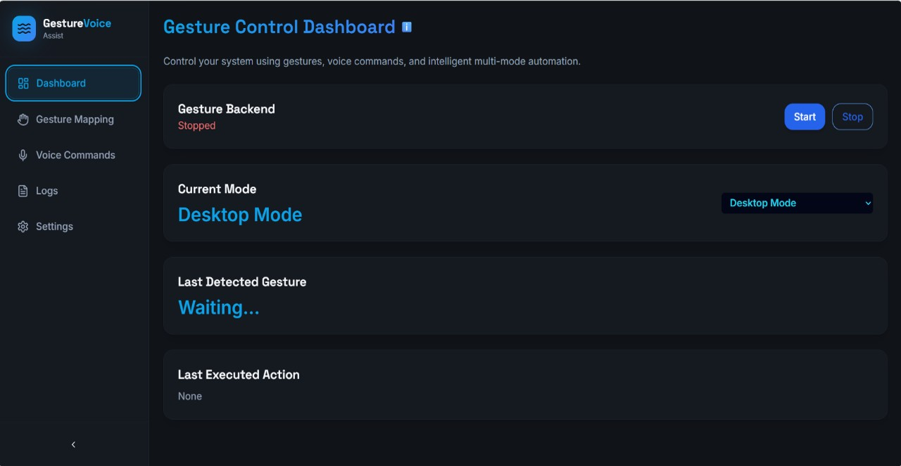
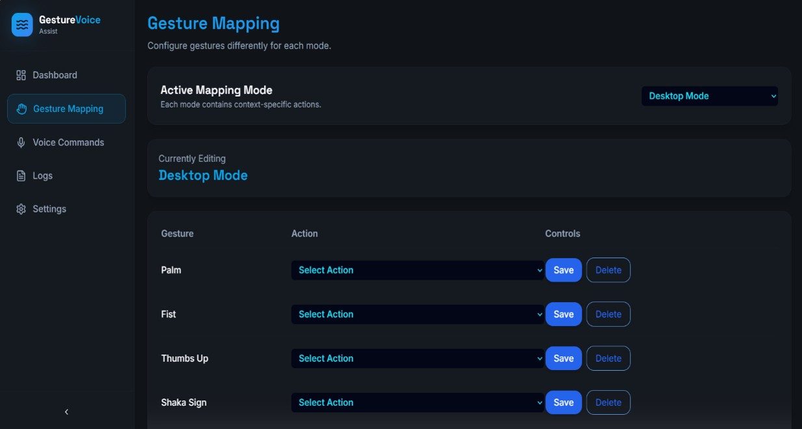
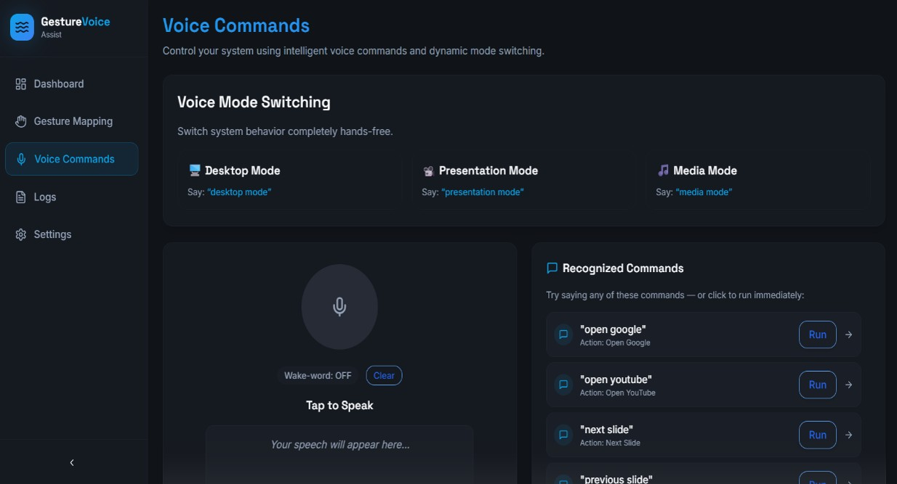
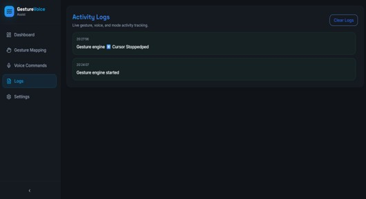
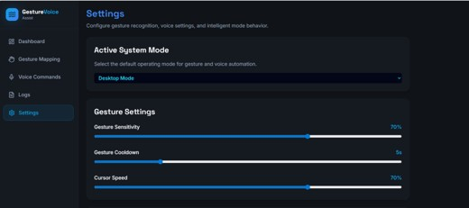
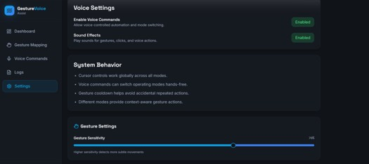
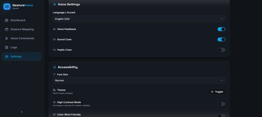

# ✋🎤 GestureVoice Assist System

A touchless **Human–Computer Interaction Platform** that enables users to control their computer using **hand gestures and voice commands** through an intelligent multi-modal dashboard.

---

## 🚀 Project Overview

GestureVoice Assist System was designed to provide a seamless and accessible way to interact with computers without traditional input devices.

The system combines **computer vision**, **voice recognition**, and **modern dashboard interfaces** to deliver a hands-free computing experience.

The platform supports multiple operational contexts including:

* 💻 Desktop Automation
* 📽️ Presentation Control
* 🎵 Media Interaction

---

## 📸 Project Screenshots

### 🎛 Dashboard

Real-time monitoring and system control.



---

### ✋ Gesture Mapping

Configure gesture-to-action mappings dynamically without modifying source code.



---

### 🎤 Voice Commands

Hands-free voice interaction with intelligent mode switching.



---

### 📜 Activity Logs

Track gesture, voice, and system events with timestamps.



---

### ⚙️ Settings

Customize gesture sensitivity, accessibility, and voice behavior.







---

## ✨ Key Features

### 🎛️ Interactive Dashboard

* Real-time backend status monitoring
* Current operating mode display
* Last detected gesture tracking
* Last executed action logs
* Start/Stop gesture engine controls

### ✋ Dynamic Gesture Mapping

* Configure gesture-to-action mappings
* Context-aware customization
* Save/Delete mappings without modifying source code
* Mode-specific gesture configurations

### 🎤 Intelligent Voice Commands

* Hands-free voice interaction
* Voice-based mode switching
* Real-time speech transcription
* Manual execution of recognized commands
* Wake-word support

### 📜 Activity Logs

* Timestamped system events
* Gesture activity tracking
* Voice activity tracking
* Executed action history
* Log clearing functionality

### ⚙️ Settings & Accessibility

* Gesture sensitivity adjustment
* Cursor speed customization
* Gesture cooldown configuration
* Voice feedback settings
* Language/accent preferences
* Theme support
* High contrast mode
* Accessibility enhancements

---

## 🏗️ System Architecture

```text
React + TypeScript Frontend
            ↓
        FastAPI Backend
            ↓
Gesture & Voice Processing Engine
            ↓
     Computer Actions
```

---

## 🛠️ Tech Stack

### Frontend

* React
* TypeScript
* Vite
* Tailwind CSS

### Backend

* FastAPI
* Python

### Computer Vision

* OpenCV
* MediaPipe

### Voice Processing

* Web Speech API

### Version Control

* Git
* GitHub

---

## ⚙️ Installation Guide

### Clone the Repository

```bash
git clone https://github.com/spurthygowda08/GestureVoice-Assist-System.git
cd GestureVoice-Assist-System
```

### Backend Setup

```bash
cd backend
pip install -r requirements.txt
python server.py
```

### Frontend Setup

```bash
cd frontend/gesture_frontend
npm install
npm run dev
```

---

## 🎯 Future Enhancements

* AI-powered gesture personalization
* User authentication
* Cloud synchronization
* Mobile companion application
* Advanced analytics dashboard
* Additional accessibility features

---

## 💡 Why This Project Matters

GestureVoice demonstrates how multimodal interfaces can improve accessibility and create intuitive ways for humans to interact with computers beyond traditional keyboards and mice.

The project emphasizes usability, configurability, and accessibility while combining computer vision and voice recognition into a unified experience.

---

## 👩‍💻 Author

**Spurthy Gowda**

GitHub: https://github.com/spurthygowda08

---

⭐ If you found this project interesting, consider giving it a star!
